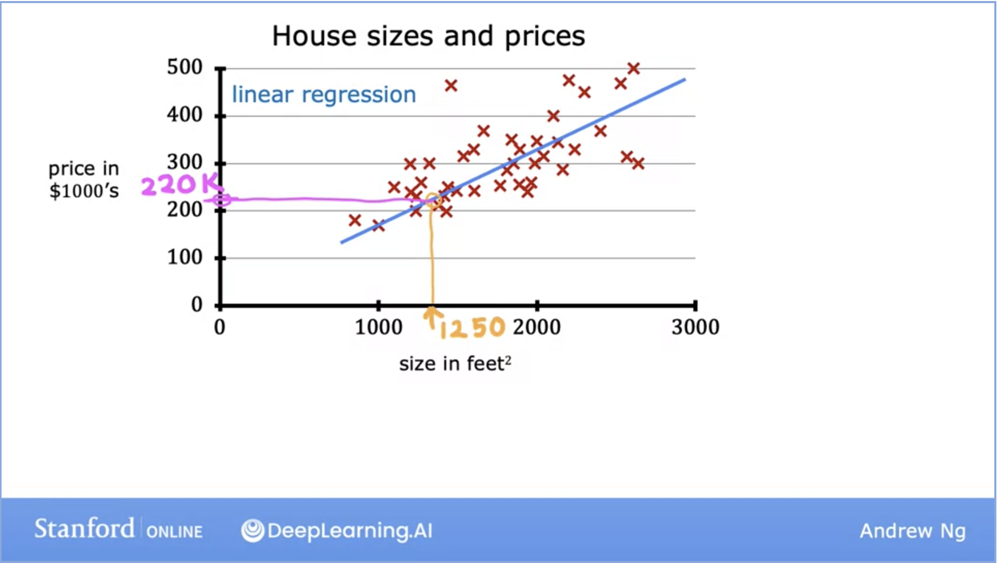
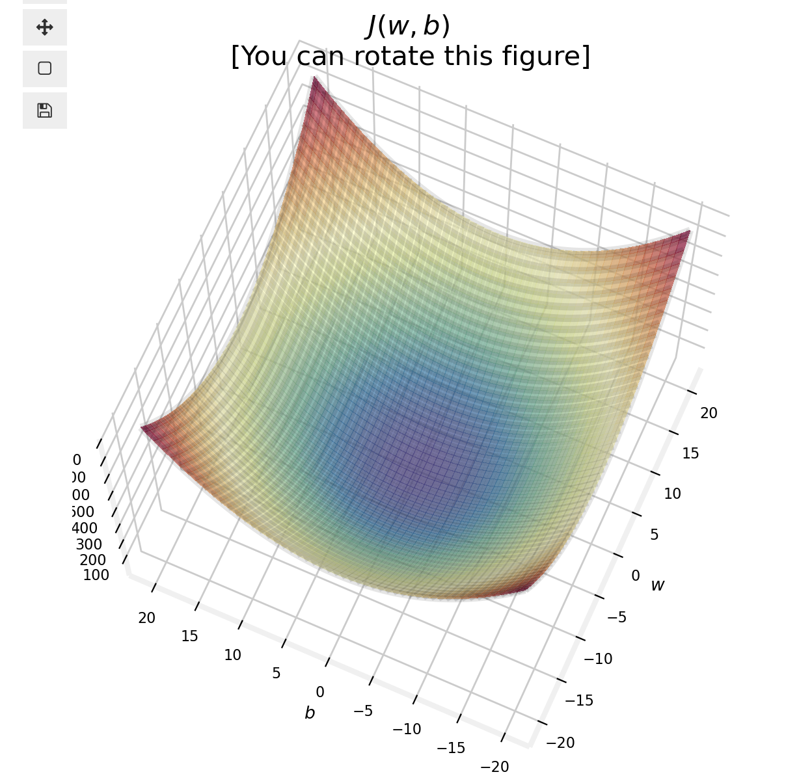
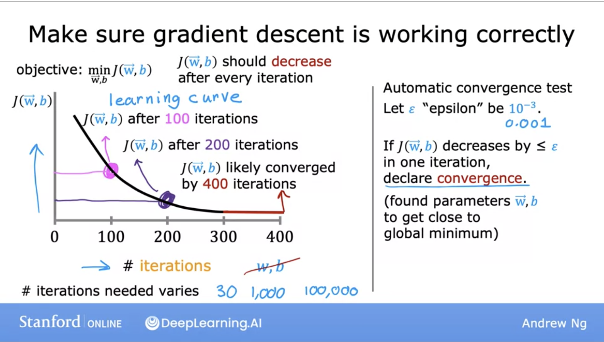
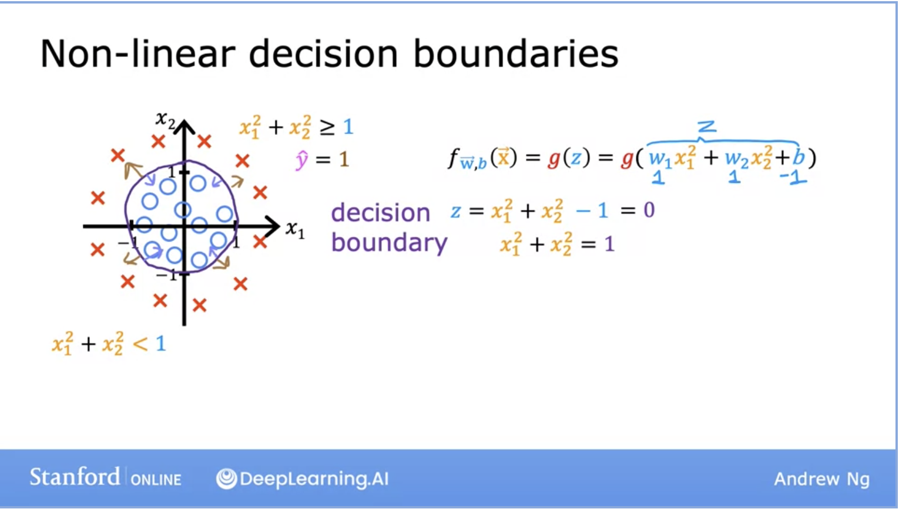
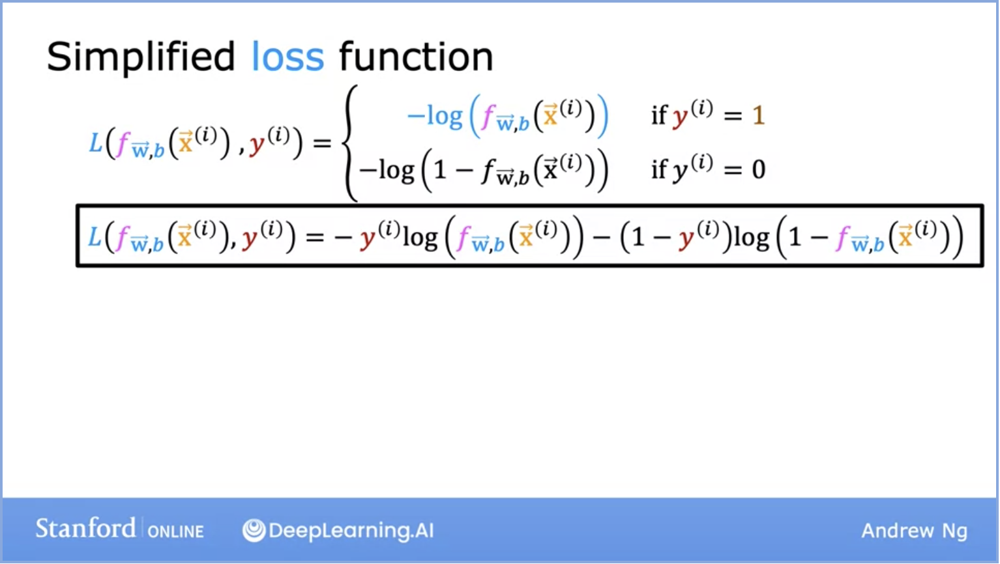

# Supervised Machine Learning: Regression and Classification

### Table of Contents

- **Machine Learning** is a Field of study that gives computers the ability to learn without being explicitly programmed
- Machine Learning Algorithms:
    - **Supervised Learning**
    - **Unsupervised Learning**
    - **Reinforcement Learning**

---

## Supervised learning

- **Supervised learning** refers to algorithms that learn x→y aka input to output mappings.
- The key characteristic of **supervised learning** is that you give your learning algorithm examples to learn from. That includes the right answers.
- It’s by seeing correct pairs of **input x** and **label y**, **supervised learning** models learns to take just the input alone and give a reasonable output y.
- the two Major types of **supervised learning** are **Regression** and **Classification**

---

---

## Supervised Learning: Regression

- Let’s dive deeper into a specific example: Housing price prediction.

---

---

- Here, the **x** (input) value is the House size in feet squared and the **y** (output) is the Price in $1000’s.
- **So how can the learning algorithm help us predict house values?**
- One thing it can do is fit a **straight**, or in this case, a **curved** line that fits the data distribution well.
- Furthermore, this housing price prediction problem is a specific type of **supervised learning** known as **regression**.
- **Regression**: Predict a number from infinitely possible outputs.

## Linear Regression

- **Linear Regression** is one example of a regression models.
- it Fits a straight line through the dataset like the example below:

---

---

- This is a **regression** model because it predicts numbers, specifically house prices per size.

---

---

---

Above we can see the breakdown of the life cycle of how a model works. 

- We start with a **training set** (with features and targets) that is fed into the learning algorithm.
- The learning algorithm then produces some **function f**, which is also called **hypothesis** in the Stanford ML lectures. This function, which is also the actual model, is fed the features and returns the prediction for the output y.

---

---

- in machine learning ************w************ and ****b parameters**** are variables that you can adjust during training in order to improve the model. They might be called **Coefficients** or **weights.**
- you can see above how the values of ************w************ and ****b****  differs how the line looks
- What if our training set had **multiple features** as input parameters?
    - Here we take the features **w** as a row vector.
    - **b** is a single number.
    - **Multiple linear regression** is the model for multiple input features. The formula is displayed below:
    
    ---
    
    
    
    ---
    

### Cost Function for Linear Regression (Squared Error)

- In order to implement **linear regression**, we need to first define the cost function.
- The **cost function** tells us how well the model is doing, so we can improve it further.
    - Depending on what the values of **w**, **b** are, our function changes.
- The **cost function** is essentially trying to find **w**, **b** such that the predicted value $\hat{y}$ is as close to the actual value for **y** for all the values of (**x, y**).

---

---

- It takes the prediction **y-hat** and compares it to the target **y** by taking $\hat{y} -y$
- This difference is called **error**, aka how far off our prediction is from the **target**.
- Next, we will compute the square of this error. We will do this because we will want to compute this value from different training examples in the training set.
- Finally, we want to measure the **error** across the entire training set. Thus, we will sum up the **squared error**.
- To build a **cost function** that doesn’t automatically get bigger as the training set size gets larger by convention, we will compute the **average squared error** instead of the total squared error, and we do that by dividing by **m** like this.
- The last part remaining here is that by convention, the **cost function** that is used in ML divides by **2** times **m**. This extra division by **2** is to make sure our later calculations look neater, but the **cost function** is still effective if this step is disregarded.
- $J(w, b)$ is the **cost function** and is also called the **squared error cost function** since we are taking the squared error of these terms.
- The **squared error cost function** is by far the most commonly used cost function for **linear regression**, and for all regression problems at large.
- The **cost function** measures how well a line fits the training data.

---

---

- Goal: Find the parameters $w, b$ ****that result in the **smallest** possible **value** for the **cost function  $J$**
- Keep in mind the cost function  $J$ will not be in a **1D** space, so minimizing this is not an easy task.

---

---

### Normal Equation

- An alternative for **gradient descent**, that works only for **linear regression** that solves for $w, b$ without iterations
- Also training becomes slow when the no. of features is large**(>10000).**
- some machine learning libraries might use **Normal Equation** to implement **Linear Regression**

### Polynomial Regression

- We’ve seen the idea of fitting a straight line to our data with **linear regression**, now lets take a look at **polynomial regression** which will allow you to fit **curves** and **non linear** functions to your data.

---

---

---

## Gradient Descent

- **Gradient descent** is a **generic optimization** algorithm used to **minimize** some function by iteratively moving in the direction of steepest descent, defined by the negative of the function’s gradient.
- The general idea of **gradient descent** is to tweak parameters iteratively in order to minimize a **cost or loss function**.
- In **gradient descent**, the update equation is given by:
    
    `theta = theta - learning_rate * gradient_of_cost_function`
    
- where:
    - `theta` represents the parameters of our model
    - `learning_rate` is a hyperparameter that determines the step size during each iteration while moving toward a minimum of a loss function
    - `gradient_of_cost_function` is the gradient of our loss function
- **gradient descent** and its variations are used to train, not just **linear regression**, but other more common models in AI.
- **Gradient descent** can be used to **minimize** any function, but here we will use it to minimize our **cost function** for **linear regression**.
- How does **Gradient Descent** minimize **linear regression** **cost function**?
    - Start with some initial guesses for parameters $**w, b**$.
    - Computes **gradient** using a single Training example.
    - Keep changing the values for $**w, b**$ to reduce the **cost function $J(w, b)$**.
    - Continue until we settle at or near a minimum. Note, some **functions** may have **more than 1 minimum**.

---

---

---

- The **learning rate alpha**, it determines how big of a **step** you take when updating **w** or $**b**$.
- If the **learning rate** is too **small**, you end up taking too many steps to hit the **local minimum** which is inefficient. **Gradient descent** will work but it will be too slow.
- If the **learning rate** is too **large**, you may take a step that is too **big** as miss the **minimum**. **Gradient descent** will fail to **converge**.

---

---

---

- In the image above, The **Gradient descent** can reach a **local minimum** instead of a **global minimum,**  depends on where you initialize your parameters .

---

---

- Fortunately, the **cost function** with **linear regression** doesn’t have multiple **minimums**, it only haves one **global minimum**, This function is called **convex function**.
- How should we choose the **learning rate** then?
    - A few good values to start off with are **0.001,0.01,0.1,1** and so on.
    - For **each value**, you might just run **gradient descent** for a handful of iterations and plot the **cost function  $J$** as a function of the number of iterations.
    - After picking a few values of the learning rate, you may pick the value that seems to **decrease** the **learning rate** rapidly.
- How do we know we are close to the **local minimum**?
    - **Gradient Descent** can reach a **local minimum** with a **fixed learning rate** because the **derivative** gets closer to **zero** when we approach the **minimum**, so eventually we take smaller steps until we finally reach a **local minimum.**
- How can we check **gradient descent** is working correctly?
    - We can have **2** ways to achieve this. We can plot the cost function **J**, which is calculated on the training set, and plot the value of **J** at each iteration (aka each simultaneous update of parameters **w, b**) of gradient descent.
    - We can also use an **Automatic convergence test**. We choose an **ϵ** to be a very small number. If the cost **J** decreases by less than **ϵ** on one iteration, then you’re likely on this **flattened** part of the curve, and you can **declare convergence**.

---

---

### Cost Function for Linear Regression Via Gradient Descent

---

---

### Gradient Descent Derivatives for multiple Linear Regression

---

---

### Batch Gradient Descent

- **Batch Gradient Descent** is a type of **Gradient Descent** algorithm that at each gradient descent step we look at all the training examples instead of a subset of the data.
- **Batch gradient descent** is an expensive operation since it involves calculations over the full training set at each step. However, if the function is **convex** or relatively smooth, this is the best option.
- **Batch G.D.** also scales very well with a **large number** of **features**.
- Computes gradient using the entire Training sample.
- Gives **optimal solution** if its given sufficient time to **converge** but it will not escape the **shallow local minima** easily, whereas **S.G.D.** can.
- **Pros**:
    - Since the whole data set is used to calculate the **gradient** it will be stable and reach the minimum of the **cost function** without bouncing around the loss function landscape (if the learning rate is chosen correctly).
- **Cons**:
    - Since **batch gradient descent** uses all the **training set** to compute the gradient at every step, it will be very slow especially if the size of the training data is large.

### Stochastic Gradient Descent (SGD):

- **Stochastic Gradient Descent** picks up a random instance in the training data set at every step and computes the gradient-based only on that **single instance**.
- It randomly selects **one training example** at a time and computes the **gradient** of the **loss function** with respect to the parameters based on that single example.
- The model parameters are then updated using this gradient estimate, and the process is repeated for the next randomly selected example.
- **SGD** has the advantage of being computationally efficient, as it only requires processing one example at a time.
- However, the updates can be noisy and may result in **slower convergence** since the gradient estimate is based on a single example.
- **Pros**:
    - It makes the training much faster as it only works on one instance at a time.
    - It become easier to train using large datasets.
    - it can escape **local minima** and decreasing the learning rate gradually it can settle near the global minimum
- **Cons**:
    - Due to the stochastic (random) nature of this algorithm, this algorithm is much less stable than the **batch gradient descent**. Instead of gently decreasing until it reaches the minimum, the cost function will bounce up and down, decreasing only on average. Over time it will end up very close to the minimum, but once it gets there it will continue to bounce around, not settling down there. So once the algorithm stops, the final parameters would likely be good but not optimal. For this reason, it is important to use a **training schedule** to overcome this randomness.

### Minibatch SGD:

- In **minibatch SGD**, instead of processing one training example (**SGD**) or a full batch of examples (**Batch SGD**) at a time, a small subset of training examples, called a **minibatch**, is processed.
- The **minibatch** size is typically larger than one but smaller than the total number of training examples. It is chosen based on the computational resources and the desired trade-off between computational efficiency and stability of updates.
- The model computes the gradient of the loss function based on the minibatch examples and updates the parameters accordingly.
- This process is repeated iteratively, with different **minibatches** sampled from the training data, until all examples have been processed (one pass over the entire dataset is called an **epoch**).
- **Minibatch SGD** provides a balance between the noisy updates of **SGD** and the stability of **Batch SGD**.
- It reduces the noise in the gradient estimates compared to **SGD** and allows for better utilization of parallel computation resources compared to **Batch SGD**.
- **Minibatch SGD** is widely used in practice as it offers a good compromise between computational efficiency and convergence stability.
- **Pros**:
    - The algorithm’s progress space is less erratic than with **Stochastic Gradient Descent**, especially with large mini-batches.
    - You can get a performance boost from hardware optimization of matrix operations, especially when using GPUs.
- **Cons**:
    - It might be difficult to escape from local minima.

### The Problem with Vanilla Gradient Descent

- In high-dimensional input spaces, **cost functions** can have many elongated valleys, leading to a zigzagging pattern of optimization if using **vanilla gradient descent**. This is because the direction of the steepest descent usually doesn’t point towards the minimum but instead perpendicular to the direction of the valley. As a result, **gradient descent** can be very slow to traverse the bottom of these valleys.

### **Gradient Descent with Momentum**

- **Gradient Descent** with **Momentum** is a technique that helps accelerate gradients vectors in the right directions, thus leading to faster converging. It is one of the most popular optimization algorithms and an effective variant of the standard **gradient descent algorithm**.
- The idea of **momentum** is derived from physics. A ball rolling down a hill gains momentum as it goes, becoming faster and faster on the way (unless friction or air resistance is considered). In the context of optimization algorithms, the ‘ball’ is the set of parameters we’re trying to optimize.
- To incorporate momentum, we introduce a variable `v` (**velocity**), which serves as a moving average of the gradients. In the case of deep learning, this is often referred to as the “**momentum term**”.
- The updated equations are:
    
    `v = beta * v - learning_rate * gradient_of_cost_function`
    
    `theta = theta + v`
    
- where:
    - `beta` is a new hyperparameter introduced which determines the level of momentum (usually set to values like 0.9)
    - `v` is the moving average of our gradients

### Advantages of Gradient Descent with Momentum

1. **Faster Convergence**: By adding a **momentum term**, our optimizer takes into account the past gradients to smooth out the update. We get a faster convergence and reduced oscillation.
2. **Avoiding Local Minima**: The momentum term increases the size of the steps taken towards the minimum and helps escape shallow (i.e., non-optimal) local minima.
3. **Reducing Oscillations**: It dampens oscillations and speeds up the process along the relevant direction, leading to quicker convergence.
- **Gradient Descent with Momentum** is a simple yet powerful optimization technique that has been proven to be effective for training deep learning models. It combines the strengths of gradient descent while overcoming its weaknesses by incorporating a momentum term, ensuring smoother and faster convergence.

### Adam Algorithm (Adaptive Moment Estimation)

- **Adam (Adaptive Moment Estimation)** is an **optimization** algorithm that’s used for updating the weights in a neural network based on the training data. It’s popular in the field of deep learning because it is computationally efficient and has very little memory requirements.
- **Adam** is an extension of the **stochastic gradient descent (SGD)**, which is a simple and efficient optimization method for machine learning algorithms. However, **SGD** maintains a single learning rate for all weight updates and the learning rate does not change during training. Adam, on the other hand, computes adaptive learning rates for different parameters.
- **Adam** works well in practice and compares favorably to other adaptive learning-method algorithms as it **converges** rapidly and the memory requirements are relatively low.
- **Adam algorithm** can see if our **learning rate** is too **small** and we are just taking tiny little steps in a similar direction over and over again. It will make the **learning rate larger** in this case.
- On the other hand, if our **learning rate** is too **big**, where we are oscillating back and forth with each step we take, the **Adam algorithm** can automatically **shrink** the **learning rate**.
- **Adam algorithm** can adjust the **learning rate** automatically. It uses different, unique learning rates for all of your parameters instead of a single global learning rate.

---

---

- **Adam algorithm** can help you train neural networks faster than gradient descent
- Below is the code for the **Adam algorithm**:

---

---

---

## Feature Scaling

---

---

- **Feature scaling** is a technique that make **gradient descent** work much better .
- This will enable **gradient decent** to run much faster.
- What **feature scaling** does is that it makes the features involved in the **gradient descent** computation are all on the similar scale.
- This ensures that the **gradient descent** moves smoothly towards the **minima** and that the steps for **gradient descent** are updated at the same rate for all the features.
- Having features on a **similar scale** helps gradient descent converge more quickly towards the **minima**.
- There are many ways to apply **Feature scaling**:

---

---

---

---

---

## Feature Engineering

---

---

---

## Supervised Learning: Classification

- There's a second major type of **supervised learning** algorithm called a **classification** algorithm
- **Classification** is different from **Regression** because it predicts **categories** not numbers where there are only a small number of possible outputs.
- Let’s dive deeper into a specific example: breast cancer detection prediction.

---

---

- You want to classify the tumors as **benign(0)** or **malignant(1)**
- Why is this a **classification** problem? Because the output here is a definitive prediction of a class (aka category), either the cancer is **malignant** or it is **benign**.
- This is a **binary classification**, however, your model can return more **categories** like the image above. It can return different/specific types of malignant tumors.
- **Classification** predicts a small finite number of possible outputs or categories, but not all possible categories in between like **regression** does.

---

---

- you can have two or more **inputs** given to the model as displayed above.
- In this scenario, our learning algorithm might try to find some **boundary** between the **malignant** tumor vs the **benign** one in order to make an accurate prediction.
- The learning algorithm has to decide how to fit the **boundary** line.
- **Linear regression** algorithm does not work well for classification problems. We can look at the image below, in the case of an **outlier x**, **linear regression** will have a worse fit to the data set and move its **decision boundary** to the right. The blue vertical decision boundary is supposed to be the decision between malignant and non-malignant.
- However, once we add the **outlier** data, the **decision boundary** changes and thus, the classification between malignant and non-malignant changes, thus giving us a much worse learned function.

---

---

### Logistic Regression

- The solution to our classification problem, it’s used for classification problems because it returns a value between **0** or **1.**
- To build out the **logistic regression** algorithm, we use the **Sigmoid function** because it is able to return us an output between **0** and **1**.
    - Lets look at its representation in the image below:
    
    ---
    
    
    
    ---
    
    We can think of the output as a “**probability**” which tells us which class the output maps to.
    
- So if our output is between **0** and **1**, how do we know which class (malignant or not-malignant) the output maps to?
    - The common answer is to pick a **threshold** of **0.5**, which will serve as our **decision boundary**.

---

---

- We can also have **non-linear decision boundarie**s like seen in the image below:

---

---

### Gradient Descent for Logistic Regression

- Remember this is the algorithm to minimize the cost function.
- One thing to note here is that even though the formula for gradient descent might look the same as it did when we were looking at linear regression, the function f has changed:

---

---

### Cost Function for Logistic Regression (Log Loss)

- One thing to keep in mind is **Loss** and **Cost function** mean the same thing and are used interchangeably.
- Below lets look at the function for the Logistic loss function. Remember that the loss function gives you a way to measure how well a specific set of parameters fits the training data. Thereby gives you a way to try to choose better parameters.

---

---

---

- Note **y** is either **0** or **1** because we are looking at a binary classification in the image below. This is a simplified loss function.

---

---

- Even though the **formula’s** are different, the **baseline** of **gradient descent** are the same. We will be monitoring gradient descent with the l**earning curve and implementing with vectorization**.

---

---

## Overfitting and Underfitting

- **Overfitting** is a problem we see when our data “**memorizes**” the **training data**. It will perform very well for training data but when it will **not generalize** well (not have the same accuracy for the **validation set**). The **cost function** might actually be **= 0** in this case. The model here has **high variance**.
    - Viable solutions for **Overfitting**:
        - **Collect** more **training** examples. With a larger training set, the learning function will be able to fit the dataset better.
        - **Select features**. See if you can use fewer or more features depending on your current model. If you have a lot of features and insufficient data, you may result in overfitting. Instead, you can select a subset of those features to use given the disadvantage of loosing some useful features.
        - **Regularization**: reduce the size of parameters. Gently reduces the impact of certain features. Lets you keep all your features but doesn’t allow any one feature to have a large impact.
            - Keep in mind, you don’t need to regularize $b$, usually just regularize $w$.
- **Underfitting** is when we have **high bias** and the data does not fit the **training set** well.
    - Viable solutions for **underfitting**:
        - Get more **training data**.
        - **Increase** the **size** or number of parameters in the model.
        - **Increase** the **complexity** of the model.
        - **Increasing** the **training** time, until **cost function** is minimized.

---

---

## Regularization

---

---

- In this modified **cost function**, we want to **minimize** the **original cost**, which is the **mean squared error** plus additionally the second term which is called the **regularization term.**
- This new **cost function** **trades off two goal**s that you might have. Trying to **minimize** this **first** term encourages the algorithm to fit the training data well by **minimizing** the **squared differences** of the predictions and the actual values. And try to **minimize** the second term. The algorithm also tries to keep the parameters **wj small**, which will tend to reduce **overfitting**. The value of **lambda** that you choose, specifies the relative balance between these two **goals**.

---

### Implementing gradient descent with Regularization

---

---

---

---

### Lasso Regularization(L1)

- **L1 regularization** or **Lasso** combats **overfitting** by shrinking the parameters towards **0**. This makes some features obsolete.
- **L1 regularization** calculates the penalty as the sum of the **absolute values** of the **weights**
- It’s a form of **feature selection**, because it tends to eliminate the **weights** of the least important features(set them to **zero**), eradicating the significance of that feature.
- **L1 regularization** tends to produce **sparse** solutions where many of the weights become exactly **zero.**
- **L1 regularization** is more robust to **outliers** since it can assign **zero weights** to features that are influenced by **outliers**. This helps to mitigate the impact of outliers on the model.

### Ridge Regularization(L2)

- **L2 regularization or** **Ridge**, combats **overfitting** by forcing weights to be **small**, but not making them exactly **0**.
- **L2 regularization** calculates the penalty as the sum of the **squares** of the **weights**.
- **L2 regularization** generally results in **non-sparse** solutions, with all the weights being reduced but rarely set to exactly zero.
- **L2 regularization** is  not robust to outliers. The **squared** terms will blow up the differences in the error of the **outliers**. The **regularization** would then attempt to fix this by penalizing the **weights**.
- **L2 regularization** does not explicitly perform **feature selection** as it does not force any weights to become exactly zero

### Elastic Net

- **Elastic net** **regularization** is a **middle** **ground** between **ridge Regression** and **lasso Regression**.
- The **regularization term** is a weighted sum of both **ridge** and **lasso’s regularization terms**

---

- when should you use **elastic** **net**, or **ridge**, **lasso**, or **plain** **linear regression** (i.e., without any **regularization**)?
- It is almost always preferable to have at least a little bit of **regularization**, so generally you should avoid plain **linear regression**.
- **Ridge** is a good default, also it is a little better when most variables are useful.
- if you suspect that only a few features are useful, you should prefer **lasso** or **elastic** **net** because they tend to reduce the **useless features’ weights** down to **zero**.
- In general, **elastic net** is preferred over **lasso** because **lasso** may behave **erratically** when the number of **features** is **greater** than the number of **training instances** or when several **features** are **strongly correlated**.

---

---