# Advanced Learning Algorithms

# Neural Networks

- The original intuition behind creating **neural networks** was to write software that could mimic how the human brain worked.
- **Neural networks** have revolutionized applications areas they’ve been a part of like speech recognition, images, text(NLP), etc..
- Let’s look at an example to further understand how **neural networks** work:
    - The problem we will look at is demand prediction for a shirt.
    - Lets look at the image below, we have our graph with the data and it’s represented by a **sigmoid function** since we’ve applied **logistic regression**.
    - Our function, which we originally called the output of the learning algorithm, we will now denote with **a** and call this the **activation function**.
    - What the **activation function** does is it takes in the **x** which in our case is the price, runs the formula we see, and returns the probability that this shirt is a top seller.
        
        ---
        
        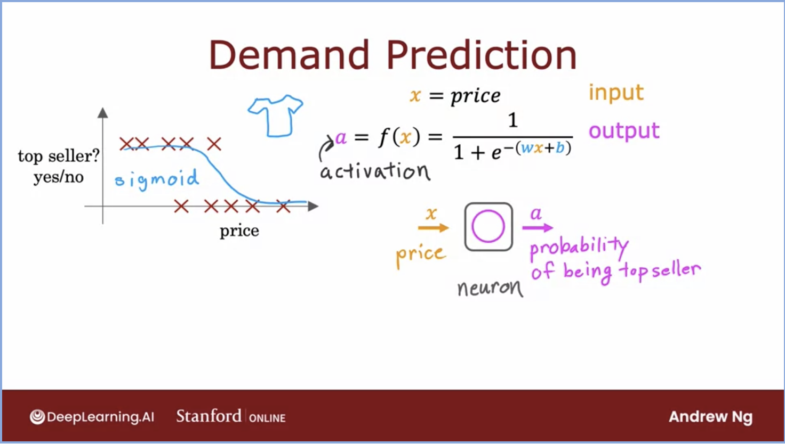
        
        ---
        
    - Now lets talk about how our neural network will work before we get to the **activation function/output**.
    - The network will take in several features (price, marketing, material, shipping cost) → feed it through a layer of neurons which will output → affordability, awareness, perceived value which will output → the probability of being the top seller.
    - Each of these tasks contains a combination of neurons or a single neuron called a “**layer**”.
    - The last layer is called the **output layer**, easy enough! The first layer is called the **input layer** that takes in a feature vector x. The layer in the **middle** is called the **hidden** layer because the values for affordability, awareness etc. are not explicitly stated in the dataset.
    - Each layer of neurons will have access to its previous layer and will focus on the subset of features that are the most relevant.
    - When you're building your own **neural network**, one of the decisions you need to make is how many **hidden layers** do you want and how many **neurons** do you want each **hidden layer** to have. choosing the right number of **hidden** layers and number of hidden units per layer can have an impact on the performance of a learning algorithm as well.
    - a **neural network** with **multiple layers** this called a **multilayer perceptron**.
    
    ---
    
    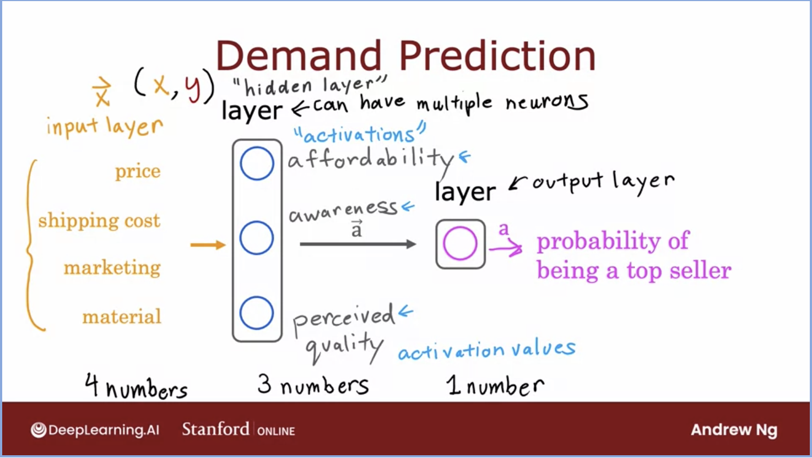
    
    ---
    
- Here’s how a face recognition works using a neural network:
    - in the first **hidden layer**, you might find that neurons is looking for vertical lines, vertical edges, oriented line or oriented edge.
    - in the next **hidden layer**, you might find that these neurons might learn to group together multiple short lines or short edges together in order to look parts of faces.
    - as you look at the next **hidden layer**, the neural network is aggregating different parts of faces to then try to detect presence or absence of larger, coarser face shapes.
    - Then finally, detecting how much the face corresponds to different face shapes creates a rich set of features that then helps the output layer try to determine the identity of the person picture.
    - A remarkable thing about the **neural network** is you can learn these feature detectors at the different hidden layers all by itself.
    - In this example, no one ever told it to look for short little edges in the first layer, and eyes and noses and face parts in the second layer and then more complete face shapes at the third layer.
    
    ---
    
    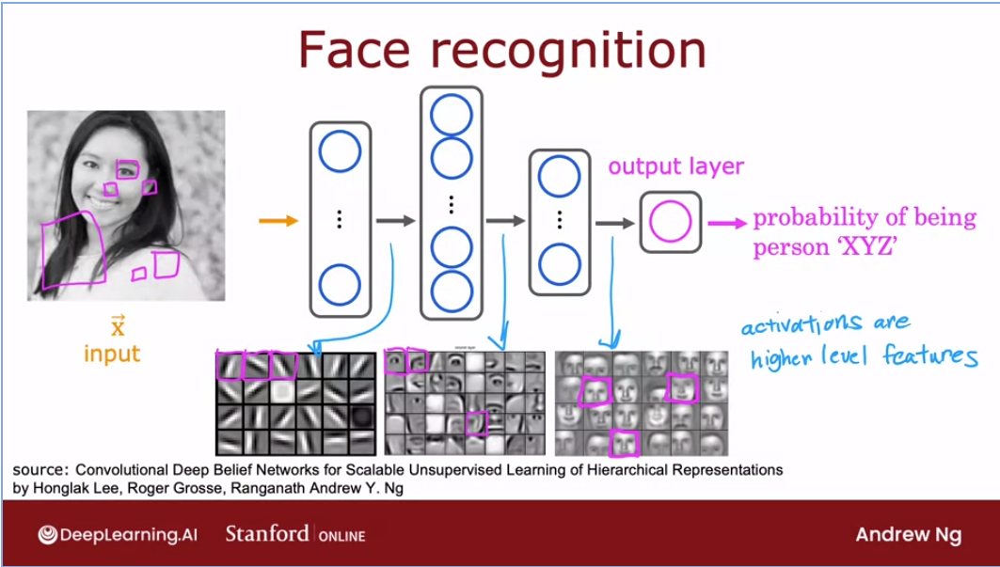
    
    ---
    

## Neural Network Layer

- The fundamental building block of modern neural networks is a **layer** of **neurons**.
- How does a **neural** network work?
- Every **layer inputs** a vector of numbers and applies a bunch of **logistic regression** units to it, and then computes another **vector** of numbers. These vectors then get passed from layer to layer until you get to the final output layers computation, which is the prediction of the neural network. Then you can either **threshold** at 0.5 or not to come up with the final prediction.
- The conventional way to count the **layers** in a neural network is to count all the **hidden** layers and the **output** layer. We do not include the **input** layer here.

---

---

---

## Forward Propagation

- **Inference**: **inference** is the process of using a trained model to make predictions against previously unseen data set.
- **Forward propagation**: going through each layer from left to right
- With **forward propagation**, you’d be able to download the parameters of a neural network that someone else had trained and posted on the Internet. You’d also be able to carry out **inference** on your new data using their neural network.

### Implement Forward Prop from Scratch

- We’ve seen how to leverage **TensorFlow**, but let’s look under the hood how these would work. This will help in the future, debugging errors in your future projects.
- At a very high level, for each layer, you would need to create arrays for the parameters **w, b** per layer.
- Each of these would be a **NumPy** array and we would then have to take their **dot product** into our value of **z**.
- This value **z** will then be given to the **sigmoid** function and the result would be the **output vector** for that layer.

---

---

Let’s dive even deeper, lets see how things work under the hood within **NumPy**.

- Here we would need to take each **neuron** and create a matrix for $**w$** and $**b**$.
- We would then also need to implement the **dense function** in python that takes in **a,W,b,g**.

---

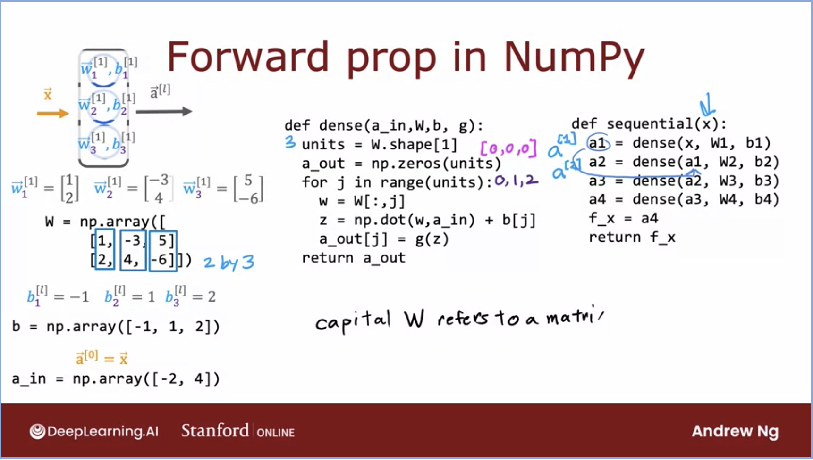

---

- Below is code for a vectorized implementation of forward prop in a neural network.

---

---

## Back Propagation

- **Back Propagation** is an efficient way to compute **derivatives**, We sequence it as a **right-to-left** calculation.
- **Back Propagation** is done using the **computation graph** to compute the derivatives.

    
    

---

## TensorFlow Implementation

- **Inference** with **TensorFlow**:

---

---

- In this image above, we can see **x** the input vector is instantiated as a **NumPy** array.
- **layer_1**, which is the first **hidden layer** in this network, is named **Dense** and its activation function is the **σ** function as this is a **logistic regression** problem.
- **layer_1** can also be thought of as a **function** and **a1** will take that function with the input feature vector and hold the **output** vectors from that layer.
- This process will continue for the **second** layer and onwards.
- Each layer is carrying out **inference** for the layer before it.
- Data Representation in **Tensorflow**:
    - **TensorFlow** was designed to handle very large datasets and by representing the data in **matrices** instead of **1D** arrays, it lets **TensorFlow** be a bit more computationally efficient internally.
    - A **tensor** here is a data type that the **TensorFlow** team had created in order to store and carry out computations on **matrices** efficiently.
    
    ---
    
    
    
    ---
    

### Building a Neural Network in TensorFlow

- If you want to train this **neural network**, all you need to do is call two functions: `model.compile()` with some parameters and `model.fit(x,y)` which tells **TensorFlow** to take this **neural network** that are created by **sequentially** string together layers one and two, and to train it on the data, x and y.
- Another improvement from our earlier code, instead of doing each layer sequentially, we can call **`model.predict(xnew)`** and it will output the value for **a2** for you given the **xnew**.
- Below is the way we would represent this in code:

---

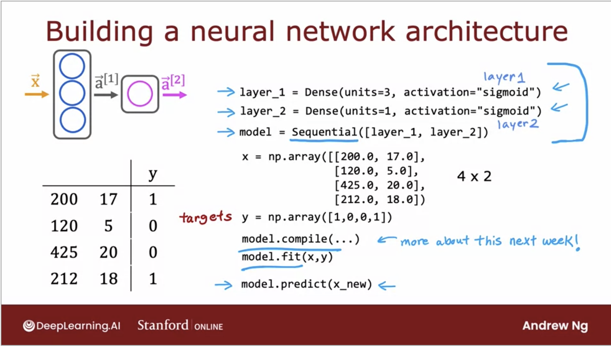

---

- And below is a more succint version of the code doing the same thing as earlier.

---

---

### Train a Neural Network in TensorFlow

- Just an aside, a basic **neural network** is also called a **multilayer perceptron**.
- We will have the same code that we have seen before, except now we will also add the **loss function**.
- Here, we use `model.compile()` and give it `BinaryCrossentropy()` as its loss value.
- After that, we will call `model.fit()` which tells **TensorFlow** to fit the model that you specified in step 1 using the loss of the cost function that you specified in step 2 to the dataset x, y.
- Note, that **epochs** here tells us the number of steps to run our model, like the number of steps to run gradient descent for.

---

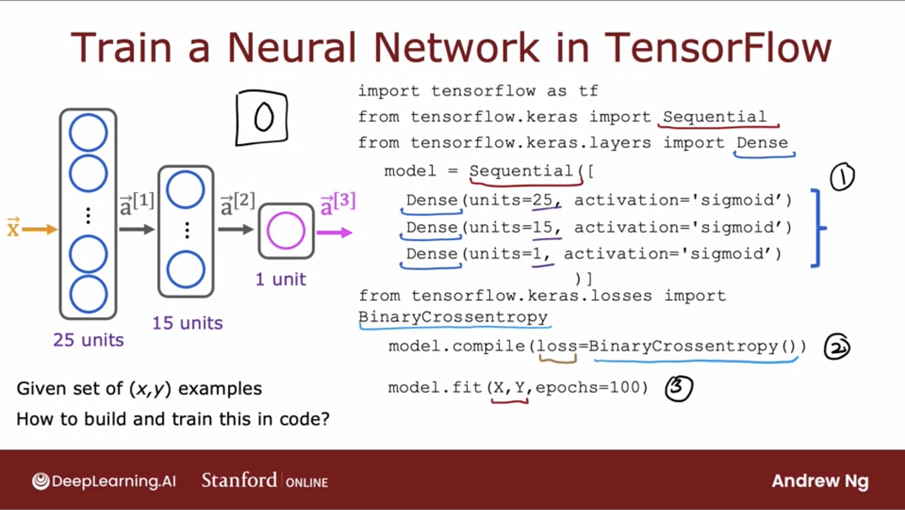

---

- Lets look in greater detail of how to **train** a **neural network**. First, a quick review of what we’ve seen so far:

---

---

Now lets look into each of these steps for a neural network.

- The **first** step is to specify how to compute the output given the input **x** and parameters **w** and **b**.
    - This code snippet specifies the entire architecture of the neural network. It tells you that there are **25** hidden units in the first **hidden layer**, then the **15** in the next one, and then **one output** unit and that we’re using the sigmoid activation value.
    - Based on this code snippet, we know also what are the parameters $w1, v1$ though the first layer parameters of the second layer and parameters of the third layer.
    - This code snippet specifies the entire architecture of the **neural network** and therefore tells **TensorFlow** everything it needs in order to compute the output x as a function.
        
        ---
        
        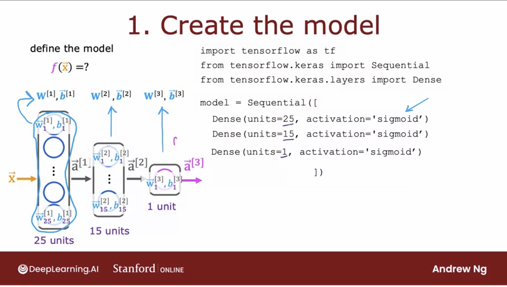
        
        ---
        
- The **second** step is to specify the **loss/cost function** we used to train the **neural network**.
    - Once you’ve specified the **loss** with respect to a single training example, **TensorFlow** will know that the **cost** you want to **minimize** is the average. It will take the average over all the training examples. You can also always change your **loss function**.
        
        ---
        
        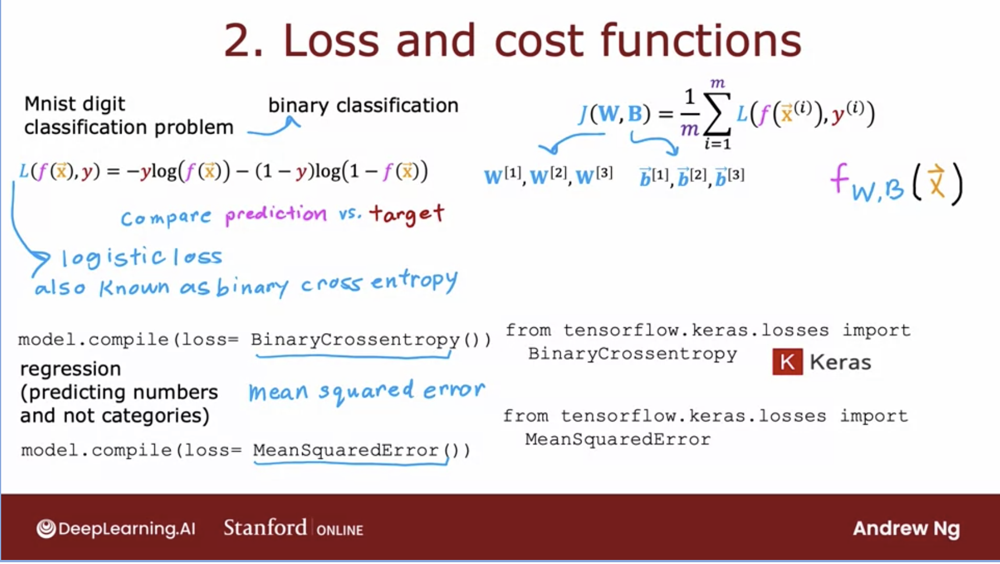
        
        ---
        
- The **last** step is to ask **TensorFlow** to **minimize** the **cost function**
    - Remember **gradient descent** from earlier.
    - **TensorFlow** will compute derivatives for gradient descent using **backpropogation**.
    - It will do all of this using `model.fit(X,y,epochs=100)`.

## Activation Functions

You can choose different **activation functions** for different neurons in your neural network, and when considering the **activation function** for the output layer, it turns out that there'll often be one fairly natural choice, depending on what is the **target label y**.

---

---

- **ReLU (Rectified Linear Unit)**
    - Most common choice, its faster to compute and Prof. Andrew Ng suggests using it as a default for all **hidden layers**.
    - It only goes flat in one place, thus **gradient descent** is faster to run unlike the **sigmoid activation** function.
    - If the output can never be negative, like the price of a house, this is the best activation function.
    - There are variants like **LeakyReLU**.
    
    ---
    
    
    
    ---
    
- **Linear activation function**:
    - Output can be **negative** or **positive**.
    - This is great for **regression** problems
    - Sometimes if we use this, people will say we are not using any **activation function**.
- **Sigmoid activation function**:
    - This is the natural choice for a **binary** classification problem as it will naturally give you a **0** or **1**.
    - It’s flat in two places so its slower than **ReLU**.
    
    ---
    
    
    
    ---
    
- Why do we need **activation functions**?
    - if we were to use a **linear activation** function for all of the nodes in this **neural network**, It turns out that this big **neural network** will become no different than just **linear regression**.
    - this would defeat the entire purpose of using a neural network because it would then just not be able to fit anything more complex than the **linear regression** model that we learned about in the first course.
    
    ---
    
    
    
    ---
    

## Multiclass Classification Problem

- This is a problem where there are more than **2** classes. This is when the target **y** can take on more than **two** possible values for its output.
- **Binary classification** only has **2** class possibilities, whereas **multiclass** can have multiple possibilities for the output.
- So now we need a new decision boundary algorithm to learn the probabilities for each class.

### Softmax Regression Algorithm

- The **softmax regression** algorithm is a **generalization** of **logistic regression**, which is a binary classification algorithm to the multiclass classification contexts.
- Basically, **softmax** is to **multiclass** what **logistic regression** is to **binary classes**.
    
    ---
    
    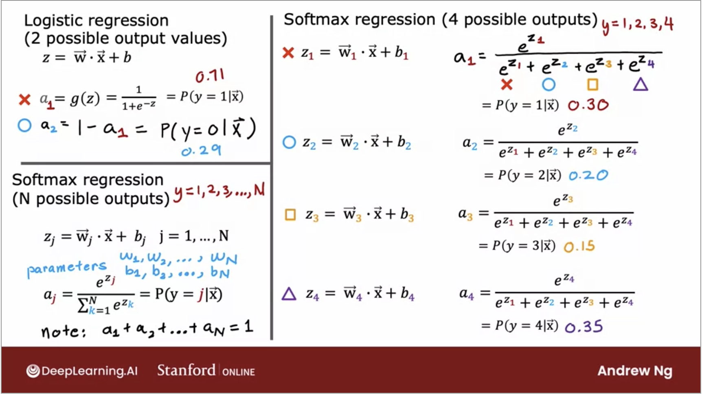
    
    ---
    
- And below is the cost function side by side for both logistic regression and softmax regression.
    
    ---
    
    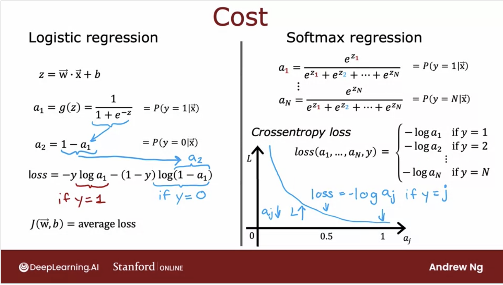
    
    ---
    
- In order to build a **neural network** to have **multiclass classification**, we will need to add a **softmax layer** to its **output layer**.
- Lets also look at the **TensorFlow** code for **softmax** below:

---

---

- This is a more accurate implementation of logistic and softmax regression to avoid Numerical Roundoff Errors

---

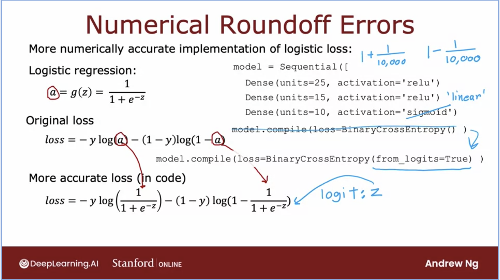

---

---

## Multilabel Classification

- There's a different type of **classification** problem called a **multi-label classificatio**n problem, which means there could be multiple **labels** with each input.

---

---

- How do you build a **neural network** for **multi-label classification**?
    - One way to go about it is to just treat this as three completely separate machine learning problems. You could build one **neural network** to decide, are there any cars? The second one to detect buses and the third one to detect pedestrians. That's actually not an unreasonable approach.
    - Another way to do this, which is to train a **single neural network** to simultaneously detect all three of cars, buses, and pedestrians, which is, the **final output layer**, in this case will have three output **neurals** and we'll output **a^3**, . Because we're solving three binary classification problems, We can use a **sigmoid activation** function for each of these three nodes in the **output layer**, and so **a^3** in this case will be a **vector** of **three numbers**

---

---

## Convolutional Neural Network

- Recap: the **dense layer** we’ve been using, the **activation** of a **neuron** is a **function** of every **single activation** value from the previous layer.
- However, there is another layer type: a **convolutional** layer.
- **Convolutional Layer** only looks at part of the previous layers inputs instead of all of them. Why? We would have **faster** compute time and need less **training data** so thus would be less prone to **overfitting**.
- **Yan LeCunn** was the researcher who figured out a lot of the details of how to get convolutional layers to work and popularized their use.
- **Convolutional Neural** Network: multiple **convolutional** layers in a network.

---

---

## Machine Learning Diagnostic

- A test that you can run to gain insight into what is or isn't working with learning algorithm to gain guidance into improving its performance.
- Diagnostics can take time to implement but doing so can be a very good use of your time

### Evaluating your model

- Having a systematic way to evaluate a machine learning algorithm performance will also hope paint a clearer path for how to improve its performance.
- If you have a training set then rather than taking all your data to train the parameters of the model, you can instead split the training set into two subsets.
- You can split the data into a training set and a test set, you can split the data 80/20, 70/30 or etc.. depends on the amount of data
- Then you can train the models parameters on the training set and then test its performance on the test set.

---

---

- In order to train a model and evaluate it, If we are using **linear regression** with a **squared error cost**.
- We Start off by fitting the parameters by minimizing the cost function **j** of **w, b** plus the **regularization term**.
- Then to tell how well this model is doing, you would compute **J** test of **w, b**, which is the average error on the **test set**, notice that the test error formula **J** **test**, it does not include that **regularization term**. This will give you a sense of how well your learning algorithm is doing.
- One other measure that is useful to measure is the **training error**, which is a measure of how well you're learning algorithm is doing on the **training set.**

---

---

- To apply this procedure to a **logistic regression** **classification** problem. First, you fit the parameters by **minimizing** the **cost function(logistic loss)** to find the parameters **w, b** plus the **regularization term**.
- To compute the **test error**, **J** **test** is then the average over your test examples, that's that 30% of your data that wasn't in the training set of the logistic loss on your test set.
- The **training error** is the average logistic loss on your **training data** that the model was using to **minimize** the **cost function J** of **w**, **b**.

---

---

- When applying machine learning to classification problems, there's actually one other definition of **J tests** and **J train** that is maybe even more commonly used. Which is instead of using the **logistic loss** to compute the **test error** and the **training error** to instead measure what the fraction of the **test set**, and the fraction of the **training set** that the algorithm has **misclassified**.

### Training/Validation/Test sets and Model Selection

---

---

- If you are training multiple models and want to perform **Model Selection**. One procedure you could try, this turns out **not** to be the best procedure, is to look at all of the **J tests** of these models, and see which one gives you the lowest value.
- The reason this procedure is flawed is **J test** of **w^5, b^5** is likely to be an **optimistic** estimate of the **generalization error**. In other words, it is likely to be **lower** than the actual **generalization error**

---

---

- Here's how you modify the training and testing procedure in order to carry out **model selection**. we're going to split your data into **three** different subsets, **training set**, **validation(dev set) set**, and **test set**.
- The name **cross-validation** refers to an extra dataset that we're going to use to check the validity or the accuracy of different models.
- In this case, instead of evaluating on your **test set**, you will instead evaluate these parameters on your **cross-validation sets.** Then, in order to choose a model, you will look at which model has the **lowest cross-validation error.**
- Finally, if you want to report out an estimate of the **generalization error** of how well this model will do on new data. You will do so using that third subset of your data, the **test set**.
- ***training set*** - used to train the model
- ***cross validation set (also called validation, development, or dev set)*** - used to evaluate the different model configurations you are choosing from. For example, you can use this to make a decision on what polynomial features to add to your dataset.
- ***test set*** - used to give a fair estimate of your chosen model's performance against new examples. This should not be used to make decisions while you are still developing the models.

### Bias and Variance

---

---

- A more systematic way to find out if your algorithm has **high bias** or **high variance** will be to look at the performance of your algorithm on the **training set** and on the **cross validation set**.

---

---

- This shows how different choices of the **degree** of **polynomial D** affects the **bias and variance** of your learning algorithm and therefore its overall performance.
- It is possible in some cases to simultaneously have **high bias** and have **high**-**variance**. You won't see this happen that much for **linear regression**, but it turns out that if you're training a **neural network**, there are some applications where unfortunately you have **high bias** and **high variance**.
- To give intuition about a **high bias, high variance** looks like, it would be as if for part of the input, you had a very complicated model that **overfit**, so it **overfits** to part of the inputs. But then for some reason, for other parts of the input, it doesn't even fit the **training** data well, and so it **underfits** for part of the input.
    
    ---
    
    
    

---

- This shows how different choices of the **regularization** parameter **Lambda** affects the **bias** and **variance** and therefore the overall **performance** of the algorithm.

---

---

### Establishing a Baseline level of performance

- Looking at whether your **training error** is large is a way to tell if your algorithm has **high bias**, but on applications where the data is sometimes noisy and is infeasible or unrealistic to ever expect to get a zero **error** then it's useful to establish a baseline level of performance.
- Rather than just asking is my **training error** a lot, you can ask is my **training error** large relative to what I hope I can get to eventually, such as, is my **training large** relative to what humans can do on the task? That gives you a more accurate read on how far away you are in terms of your **training error** from where you hope to get to. Then similarly, looking at whether your **cross-validation error** is much larger than your **training error**, gives you a sense of whether or not your algorithm may have a **high variance** problem as well.

---

---

---

### Learning Curves

- **Learning Curves** are a way to understand your learning algorithm is doing as a function of the amount of experience it has, experience meaning number of instances.

---

---

- in the plot above we can see that as we increase the no. of **training instances**, the **training error** will increase and the **validation error** will decrease. They both get flatten out after a limit, and will never increase or decrease.
- As the number of ***training* instances** increases, it's become hard to fit the **regression** line perfectly, which eventually increases the ***training error*.**
- If we have fewer ***training* instances**, then our model doesn't not ***generalize*** well, by increasing the **training instances**, the ***validation error*** will decrease and the model will ***generalize* better.**

---

---

- In the plot above if we compare the ***training error*** with **baseline performance**, i.e. *human level performance*, we can see that the difference is **high**, which shows it's case of **High Bias**, and by adding more *training* examples, it will not help to reduce the **Bias**.

---

---

- In the plot above the ********************************************training error******************************************** is lower than the ********************************************************baseline performance,******************************************************** also the difference between the ******************************training error****************************** and the **********************************validation error********************************** is **********************************high.**********************************
- By increasing the number of ***training* instances**, the ***training error*** will start increasing and the **validation error** will decrease, so we can say that adding more **********************************training instances********************************** reduces the ********variance******** and the model is less likely to ****************overfit.****************

### The Bias/Variance Trade-off

- How to fix models with **High Variance**?
    - Get more **Training instances**
        - getting more **instances** will help the model to generalize better, hence reducing its **variance**
    - Try smaller set of **features**
        - getting rid of irrelevant, noisy, redundant features will make the model less complex, hence reducing its variance
    - Try Increasing $\lambda$
        - Increasing $**\lambda**$  will force the model to reduce the feature weights ****w**** to fit a smoother less wiggly function that reduce the high variance problem.
    - Simplify the model
        - Simplify the model by selecting one with fewer parameters (e.g., a linear model rather than a high-degree polynomial model)
- How to fix models with ********************High Bias?********************
    - Try adding additional features
        - Adding more meaningful features will help the model fit the data better and reduce the high bias
    - Try a more powerful model
        - Selecting a more powerful model, with more parameters like a polynomial regression instead of linear regression can help the model better fit the data and reduce the bias
    - Try decreasing $\lambda$
        - Decreasing $\lambda$ will force the model increase the feature weights ****w**** to better fit the data better to reduce bias

### Bias/Variance and Neural Networks

- One of the reasons that neural networks have been so successful is because neural networks, together with the idea of big data has given us a new way to address both **high bias** and **high variance**.
- Large **neural networks** when trained on moderate size datasets are low bias machines. This means if you make your neural network large enough, you can almost always fit your training set well as long as your training set is not enormous.
- This gives us a new recipe to reduce bias and variance without needing trade-off between the two of them.

---

---

- What are the limitations of this recipe?
    - Training large **neural networks** does reduce **bias**, but at some point it does get computationally expensive
    - It is not always easy to get more **data**
- Is a large **Neural network** creates a **high variance** problem?
    - It turns out that a large neural network with a well-chosen regularization well usually do as well or better than a smaller one.

## Machine Learning development process

---

### Iterative Loop of ML development

---

### Error Analysis

- **Error Analysis** is Manually examine the **errors** that the model made, categorize them based on common trait and find ways to improve the model.
- This will often create for what might be useful to try next and sometimes it can tell you that certain types errors are sufficiently rare that they are worth as much of your time to try to fix
- One limitation of **Error analysis** is that it's much easier to do for problems that humans are good at. You can look at the email and say you think is a spam email, why did the algorithm get it wrong? **Error analysis** can be a bit harder for tasks that even humans aren't good at.

---

---

## Engineering the Data used by your system

---

---

### 1.Adding Data

- Sometimes, adding more data can help our machine learning model to improve it's performance, like when we have high variance problem.
- You can either add more data of everything or add more data of the types where error analysis has indicated it might help.

### 2.Data Augmentation

- ******************************************Data Augmentation****************************************** is modifying an existing training example to create a new training example.
- Example: if you’re dealing with images, you can create new images by rotating, enlarging, shrinking or changing the contrast in the image
- Creating additional example like this holds the learning algorithm do a better job learning how to recognize this image

---

---

---

- You need to make sure that the changes or the distortion you make to the data, should be representative of the types of noise or distortions in the test set(IRL data).
- It is usually doesn’t help to add purely random/meaningless noise to your data

### 3.Data Synthesis

- **Data Synthesis**: is using artificial data inputs to create a new training example from scratch.
- Example: Artificial **Data Synthesis** for photo OCR(Having the computer read the text that appears in an image), one way to create artificial data for this task is creating random texts with random fonts using your text editor and screenshot it using different colors and different contrasts
- **Data Synthesis** is mostly used for computer vision tasks and less for other applications.

### 4.Transfer Learning

- **Transfer learning** is a technique in machine learning in which knowledge learned from a task is re-used in order to boost performance on a related task
- For an application where you don’t have that much data, Transfer learning is a wonderful technique that lets you use data from a different task to help on your application

---

---

- In the image above, you want to build a model that recognizes the handwritten digits from 0 to 9 but you don’t have that much labeled data.
- What you can do is find a very large data set of images of animals, people, cars , etc.., Train a neural network on this large dataset and train the algorithm to take as input an image X, and learn to recognize any of these 1,000 different classes.
- In this process, you end up learning parameters from the first layer to the output layer of the neural network.
- To apply **transfer learning**, what you do is then make a copy of this neural network where you would keep the parameters of every layer except the last layer, you would eliminate the output layer and replace it with a much smaller output layer with just 10 rather than 1,000 output units.
- These 10 output units will correspond to the classes zero, one, through nine that you want your neural network to recognize. You need to come up with new parameters to the new output layer, you can run an optimization algorithm such as GD, Adam GD with the initialized parameters.
- In detail, there are two options for how you can train this neural networks parameters.
    - **Option 1:** is you only train the output layers parameters. You would take the initialized parameters  as the values from on top and just hold them fix, and use an algorithm like Stochastic GD or the Adam optimization algorithm to only update the output layer to lower the usual cost function that you use for learning to recognize these digits. ( works with very small training set)
    - **Option 2** would be to train all the parameters in the network but the first four layers parameters would be initialized using the values that you had trained on top. ( works with little bit larger training set)
- Transfer Learning summary:
    1. **Supervised Pre-training:** Training a model on large dataset of not quite the related task
    2. **Fine Tuning:** Taking the parameters you had initialized or got from **supervised pre-training** and run **GD** to further modify the weights to suit the specific application of the new task.
- A good thing about **transfer learning** is sometimes you don't need to be the one to carry out **supervised pre-training**. For a lot of neural networks, there will already be researchers they have already trained a neural network on a large image and will have posted a trained neural networks on the Internet, freely licensed for anyone to download and use.
- What that means is rather than carrying out the first step yourself, you can just download the **neural network** that someone else have trained and then replace the output layer with your own output layer and carry out either **Option** 1 or **Option 2** to fine tune the neural network.
- What is the intuition behind Transfer learning?
    
    ---
    
    
    
    ---
    
    1. First layer will learn to detect edges in the image.
    2. Second layer will learn to detect corners in the image.
    3. Third layer will learn to detect curves and basic shapes in the image.
    4. With lots of different images, our model will learn to detect corners, edges and shapes in the images.
    - One important thing to remember while doing **Transfer learning** is that both the models should be doing same type of input(task).
        - If we want to do ***Image recognition*** task, then the pre-trained model should also be doing *Image recognition* task.
        - If we are doing ***Speech recognition*** task, then the pre-trained whose weights we are using should also some kind of voice related task.

## Full Cycle of a Machine Learning Project

---

---

---

### Fairness, Bias and Ethics

---

---

---

---

## Skewed Datasets

---

- **Skewed Datasets** is when the ratio of positive to negative examples is very skewed, very far from 50-50, it turns out that the usual error metrics like **accuracy** don't work that well.
- When working on problems with **skewed data** sets, we usually use a different **error metric** rather than just classification error to figure out how well your learning algorithm is doing. In particular, a common pair of error metrics are **precision** and **recall.**

---

- In the ideal case, we like for learning algorithms that have high precision and high recall, But it turns out that in practice there's often a **trade-off** between **precision** and **recall**.

---

---

---

- **Harmonic mean** is a way of taking an average that emphasizes the smaller values more

## Decision Trees

- You can think of a **decision tree** like a flow chart, it can help you make a decision based on previous experience.
- From each node, you will have two possible outcomes and it will rank the possibility of each outcome for you.

---

---

- The **root node** is the topmost node of the tree.
- **Decision nodes(non-leaf nodes)** are nodes that look at particular feature and then based on the value of the feature cause you to decide whether to go left or right down the tree.
- **Leaf nodes** are nodes that make predictions.
- The job of the Decision Tree algorithm is out of all possible decision trees, try to pick one that hopefully does well on the training set and also generalize well to new data.
- Different Decision Trees below:

---

---

### Decision Tree Learning

- The process of building a decision tree makes a couple of key decisions at various steps during the algorithm.
- ********Decision 1:******** How to choose what feature to split on at each node?
    - Decision trees choose what to  feature to split on in order to try to maximize **************purity(**************minimize **************impurity),************** meaning the feature that subsets the data into highly pure subsets**************.**************
- ************************Decision 2:************************ When do you stop splitting?
    - When a node is 100% one class, Because at this point it seems natural to build a ********************leaf node******************** that makes a classification prediction.
    - When splitting a node will result in the tree exceeding a maximum depth(you set that parameter)
        - The depth of a node is defined as the number of hops that it takes to get from the toot node to that particular node.
        - one reason to limit the depth of the decision tree is to make sure that it doesn’t get too big and unwieldy
        - second, by making the tree small, it less prone to ************************overfitting.************************
    - When improvements in purity score are below a threshold.
        - If splitting a node results in minimum improvements to purity or decreases impurity
        - This is to make the tree smaller and to reduce the risk of **********************overfitting**********************
    - When the number of examples in a node is below a threshold.
        - This also to make the tree smaller and to reduce the risk of ************************overfitting.************************

### Measuring purity

- The **********************************Entropy Function********************************** a measure of the impurity of a set of data, it starts from zero up to one as a function of the fraction of positive examples in your sample.
- There is other functions that go from zero to one and then back down like the **Gini Impurity.**

---

---

- The curve is at its highest when the set of examples is 50-50, $H(p_{1}) = 1$ so it’s most impure.
- Whereas in contrast, if your set of examples is either all cats or all dogs, then the ********************************entropy is zero.********************************

---

---

- By convention, When we computing ****************entropy**************** we take ********log******** of base ******2****** than to base ******************e,****************** To make the peak of the curve equal to ********one,******** In this case it will be easier to interpret.

### Choosing a Split, Information Gain

- When building a **decision tree**, the way we’ll decide what feature to split on at a node will be based on what choice of feature reduces **entropy** the most. Reduces **entropy** or reduces **impurity**, or maximizes **purity**.
- How To compute ******************information gain****************** and choose what features to use to split on at each node?
    - First you compute the entropy of all sub-branches of all possible trees
    - Take the **weighted average** of each tree, because how important it is to have a low entropy in the left or the right sub-branch also depends on how many examples went into the left or the right sub-branch(more examples = more importance to get low entropy).
    - After computing the **weighted average** of every tree, we then pick the lowest value which is the **lowest average entropy**.
    - Rather than computing the **average weighted entropy**, we can compute the **reduction in entropy** compared to if we hadn’t split at all, which is the difference between the original entropy and the weighted average.
    - We then choose the tree with the highest ******************************************reduction in entropy.******************************************
    - **Information gain** = reduction of **entropy**. **Information gain** lets you decide how to choose one feature to split a one-node.
    
    ---
    

---

- Why do we bother to compute **********************************reduction in entropy********************************** rather than just ************************************************average weighted entropy?************************************************
    - It turns out the stopping criteria for deciding when to not bother to split any further is if the **reduction in entropy** is too small, in which case you are increasing the size of tree and increasing the risk of **overfitting.**

---

---

## One-Hot Encoding for Categorical Features

- If a **categorical feature** can take on $k$ values, Create $k$ binary features(0 or 1 valued).

---

---

- With a **one-hot encoding** you can get your decision tree to work on features that can take on more than two discrete values.
- **One-hot encoding** is a technique that works not just for **decision tree** learning but also lets you encode categorical features using ones and zeros, so that it can be fed as inputs to a neural network as well which expects numbers as inputs.

### Continuous Valued Features

---

---

- To get the **decision tree** to work on continuous value features at every node. Try different **thresholds**, do the usual **information gain** calculation and split on the continuous value feature with the selected threshold if it gives you the best possible **information gain** out of all possible features to split on.

### Regression with Decision Trees: Predicting a Number

- The ******************Decision Tree****************** is going to make predictions based on taking the average of the weights in the **leaf node.**

---

---

- When building a **********************************Regression Tree,********************************** Rather than trying to reduce ********entropy******** used in a classification problem, we instead try to reduce the ******************variance****************** of the weights of ******************y values****************** at each subset of the data******************.******************
- ******************Variance****************** computes how widely a set of number varies.
- Instead of calculating the ****************************************************weighted average entropy,**************************************************** we will calculate the ********weighted average variance******** and choose the lowest value.
- Also instead of measuring the ********************************************reduction in entropy,******************************************** we will measure the **************reduction in variance************** and choose the highest value.

## Tree Ensembles

- One of the weaknesses of using a single ****************************decision tree**************************** is that it can be highly sensitive to small changes in the data, one solution to make the algorithm less sensitive or more robust is to build a lot of ****************************************decision trees,**************************************** we call that ****Tree Ensemble.****

---

---

- Tree ensemble is a multiple decision trees collection.
- You make predictions by running your test example on all the trees and get each one of them to vote and get the **majority vote** of the predictions among all trees.

### Sampling with Replacement

- The way that **sampling with replacement** applies to building an **ensemble** of **trees** is by constructing multiple random training sets that are slightly different from the original training set.
- **With replacement** means training instances can be sampled more than once in each random training set.

### Random Forest Algorithm

---

---

- This is called **Bagging Decision trees**, **Ensemble** of **trees** created by **sampling with replacement**
- There is also **Ensemble of trees** created by **sampling without replacement** is called ********************************************pasting Decision Trees********************************************
- Typical choice of $B$ the number of trees you build might be around a 100 (64:128recommended) , you make predictions by getting all these trees vote on the correct final prediction.
- Setting out $B$ to be larger, never hurts performance, but beyond a certain point , you end up with diminishing returns, it doesn’t actually get better and it will slow the computation significantly.
- There’s one modification that we can apply to the **Bagging decision trees** to make it work even better. This changes the algorithm from **Bagging decision trees** to **Random forest algorithm**.

---

---

- A **random forest** is a technique that’s used to solve regression and classification problems.
- It utilizes **ensemble learning**, which is a technique that combines many classifiers to provide solutions to complex problems.

### XGBoost

---

---

- The idea of **boosting** works by looking at decision trees we’ve trained so far and look at what we’re still not yet doing well on, then when building the next decision trees we’re going to focus more attention on the examples that we’re not yet doing well.

---

---

- **Extreme Gradient Boosting** or **XGBoost** is a distributed gradient-boosted decision tree.
- It provides parallel tree boosting and is the leading machine learning library for regression, classification, and ranking problems.
- Instead of doing **sampling with replacement XGBoost** actually assigns different weights to different training examples. So it doesn't actually need to generate a lot of randomly chosen training sets and this makes it even a little bit more efficient than using a **sampling with** **replacement** procedure.
- `from xgboost import XGBClassifier` or `from XGBoost import XGBRegressor` for classification vs. regression.

---

---