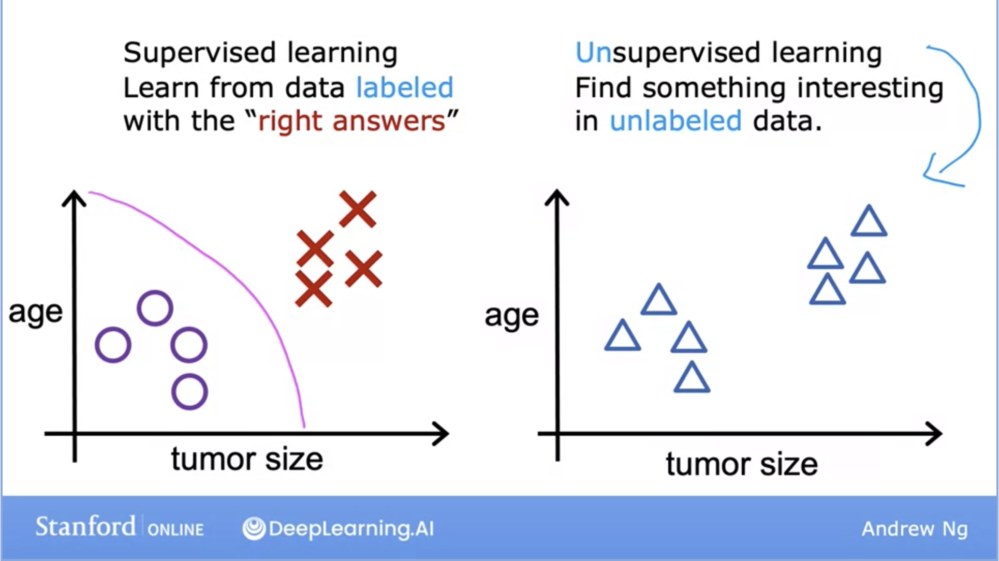
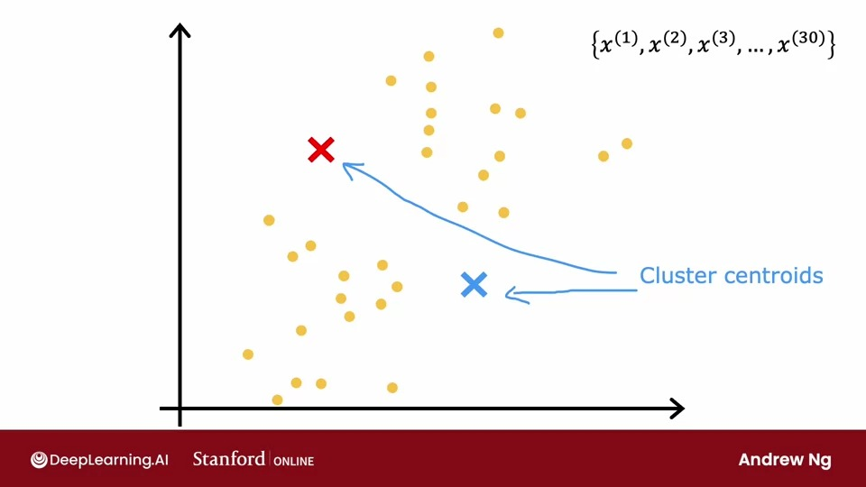

# Unsupervised Learning, Recommenders, Reinforcement Learning

## Unsupervised Learning

- After **supervised learning**, the most common form of machine learning is **unsupervised learning**. In **unsupervised** learning, we are given data without any output **labels y**.
- Data comes with **inputs x** but no **outputs y** and the algorithm has to find structure in this data.
- **Unsupervised** learning model is to find the some structure, some pattern or something interesting in the data.

- We’re not asked here to predict whether the tumor is malignant or benign because we are not given any labels of which tumor is which.
- Instead, our job is to find some pattern, or some data, or just something interesting within this unlabeled dataset.
- The reason this is called unsupervised learning is that we are not asking the algorithm to give us a “right answer”.
- In this example, our unsupervised algorithm might decide there are two clusters, with one group here and one there.
- This is a specific type of **unsupervised learning** algorithm called **clustering** algorithm because it places the unlabeled data into different clusters.

## Unsupervised learning: Clustering

- **Clustering** groups similar data points together.
- **Clustering** has many use cases:
    - It is used in Google News! Google News looks at 100’s of stories every day and clusters them together.
    
    
    
    - It is used in DNA microarray clustering. The red here might represent a gene that affects eye color, or the green here is a gene that affects how tall someone is.
        - You can run a clustering algorithm to group different types of individuals together based on categories the algorithm has automatically decided.
    - It is used in grouping customers in different market segments to better understand a company’s consumer base. This could help in improving marketing strategies for each group.

### K-means Algorithm

- The first thing that K-means does is it will take a random guess at where might be the centers of the clusters that you ask it to find.
- It will randomly pick two points at where might be the centers of the two different clusters, This is just a random initial guess and they’re not particularly good guesses.
- Then, **K-means** will repeatedly do two different things. The first is assign points to cluster centroids and the second is move **cluster centroids**.

- **K-means** will go through all training examples, and for each of them it will check if it closer to the red or blue cluster **centroid**.
- Then, it will assign each point to its closest **centroid**.

- Then, The algorithm will look at all of the red points and take the average of them, and move the red cross to that average location and do the same thing with blue cross.

- After repeating these two steps, You will find that there are no more changes to the colors of the points or the location of the **clusters centroids**.
- This means that at this point the **K-means algorithms** has converged

- $\mu$ are vectors that have the same dimensions as your training examples
- What happens if a cluster has zero training examples assigned to it?
    - The most common thing to do is just eliminate that cluster, you will end up with $k-1$  clusters
    - If you need $k$ clusters, you can randomly reinitialize that cluster centroid  and hope it gets assigned at some points.

### Anomaly Detection Algorithm

- **Anomaly Detection** is another specific type of unsupervised learning and it is used to detect unusual events or data points
- Anomaly Detection is used in:
    - **Fraud** Detection

### Dimensionality Reduction

- Compress data using fewer numbers.